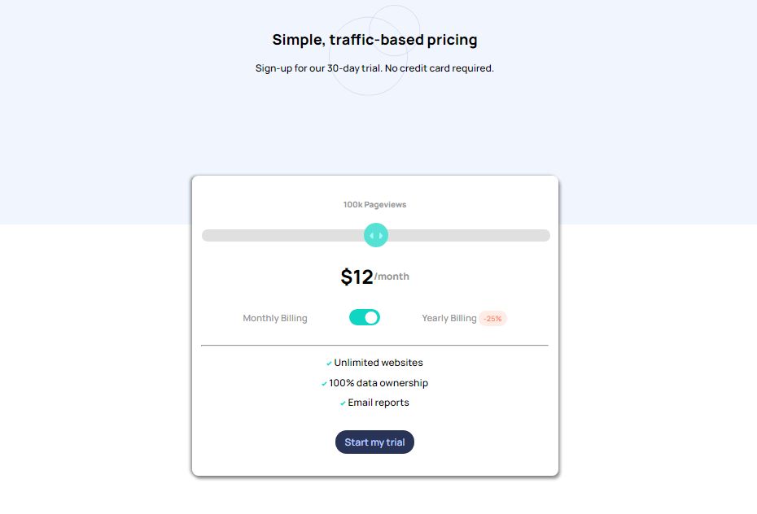

# Frontend Mentor - Interactive pricing component solution

## Table of contents

- [Overview](#overview)
  - [The challenge](#the-challenge)
  - [Screenshot](#screenshot)
  - [Links](#links)
- [My process](#my-process)
  - [Built with](#built-with)
  - [What I learned](#what-i-learned)
- [Author](#author)

## Overview

### The challenge

Users should be able to:

- View the optimal layout for the app depending on their device's screen size
- See hover states for all interactive elements on the page
- Use the slider and toggle to see prices for different page view numbers

### Screenshot

### Links

- Solution URL: [Add solution URL here](https://github.com/md-akram/interactivePricingComponent)
- Live Site URL: [Add live site URL here](https://md-akram.github.io/interactivePricingComponent)

## My process

### Built with

- Semantic HTML5 markup
- CSS custom properties
- Flexbox
- CSS Grid
- Mobile-first workflow

### What I learned

White completing this project I came to know how to make "custom range" and "toggle switch".

In the JS part I used custom range value and toggle switch value to change the output.

## Author

- Github - [Md-Akram](https://github.com/md-akram)
